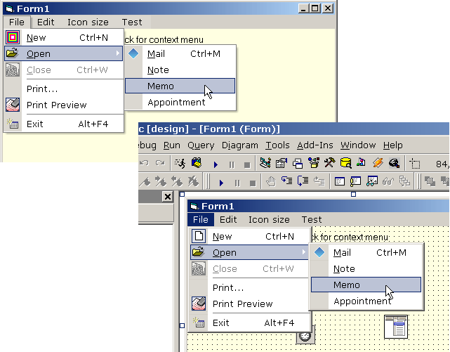



## Subclassing Thunk \(VB\+ASM = Office XP Menus  :\-\)\) w/ Sample HookMenu 1\.4

### Description

UPDATE(2002-12-13): Sample HookMenu 1.4 introduces RightToLeft forms support.

----

UPDATE(2002-11-27): Sample HookMenu 1.3.5 fixes problems with MDI forms. Separators are reduced to 3 pixels to match Office XP ones. You can use DontHookMenu=1 when debugging and the control is part of your project.

----

UPDATE(2002-11-23): Sample HookMenu 1.3.4 fixes troubles in NT 4.0, menubar background color in Win XP classic appearance and sub-menu arrow forecolor if menu text is not black.

----

UPDATE(2002-11-21): Sample HookMenu 1.3.3 fixes an XP redraw bug, an accelerator (underlined) symbols bug and keyboard navigation in Win9x. Sample HookMenu 1.3.2 adds custom drawing of sub-menus arrows and fixes unicode strings support. Various fixes for Win95 support.

----

UPDATE(2002-11-20): Sample HookMenu 1.3.1 fixes issues with WindowList menus and 3rd level sub-menus positioning.

----

UPDATE(2002-11-18): Sample HookMenu 1.3 fixes issues with the subclasser (both in Win 9x and NT/2K/XP) so no more GPFs. Closer Office XP experience: menu colors are closer to Office values in 8bit color depth and in high contrast color scheme; menu shadow simplified as in Office in 8bit color depth; popup menus are positioned manually two pixels down; seamless shadow if popup is above the menubar.

----

UPDATE(2002-11-12): Sample HookMenu 1.2 fixes the issue with TextBox popup menus (finally!). Some design time issues and menubar background color problems spotted by Ovidiu Boldea. Also, the property page is working more fluently now. I'm sick of win9x and so these are not supported from now on (ok, promise to do my best:-)).

----

UPDATE(2002-11-10): Sample HookMenu 1.1 fixes issues in NT 4.0 and MDI child forms. Can anyone test the control under win95?

----

This is a second attempt on moduleless window subclasser featuring "run-time dynamically generated machine code". The original was submitted by Paul Caton a couple of months ago. The present version is safer and is based on a completely rewritten assembly thunk. Also I have changed the name of the subclasser to reflect more closely what in fact it's doing. In addition to this you get the hooking thunk which (you guessed it) hooks windows hooks in a convenient and safe way. Both of the thunks' source files (assembly) are included. Both thunks are designed to be and have shown to be exceptionally safe in the IDE, they seem immune to both the end button and End statement - try to crash them and let me know what your results are. The screenshot is from a sample project (included in the zip) which subclasses a form's menus and turns them into Office XP clones - now it's not necessary to include 13000 lines of "supercode" to get the Office XP style menus under win 98/2000/XP/.Net Server (not tested on 95/NT btw). Enjoy and leave your votes!
 
### More Info
 

             |
---                |---
**Submitted On**   |2002-11-27 22:56:30
**By**             |[Vlad Vissoultchev](https://github.com/Planet-Source-Code/PSCIndex/blob/master/ByAuthor/vlad-vissoultchev.md)
**Level**          |Advanced
**User Rating**    |4.9 (716 globes from 146 users)
**Compatibility**  |VB 6\.0
**Category**       |[Custom Controls/ Forms/  Menus](https://github.com/Planet-Source-Code/PSCIndex/blob/master/ByCategory/custom-controls-forms-menus__1-4.md)
**World**          |[Visual Basic](https://github.com/Planet-Source-Code/PSCIndex/blob/master/ByWorld/visual-basic.md)
**Archive File**   |[Subclassin15126212132002\.zip](https://github.com/Planet-Source-Code/vlad-vissoultchev-subclassing-thunk-vb-asm-office-xp-menus-w-sample-hookmenu-1-4__1-40518/archive/master.zip)

